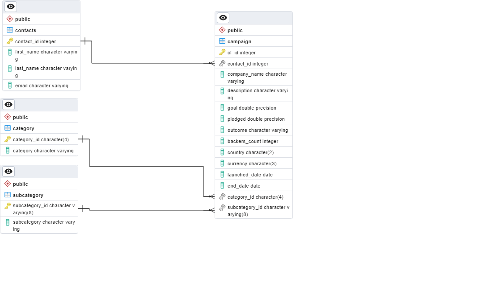
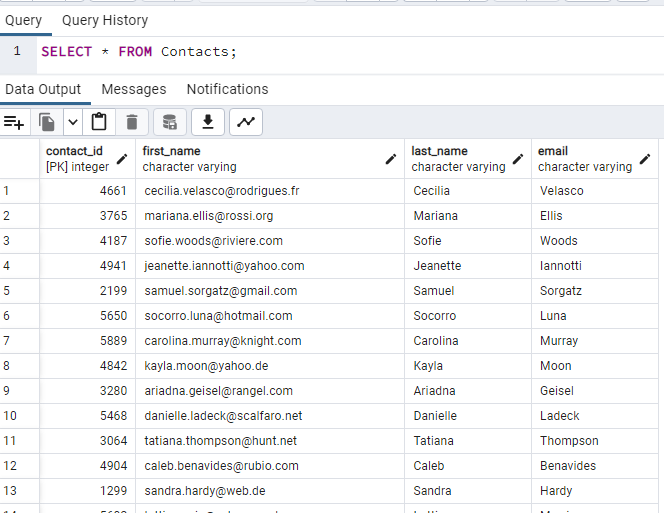
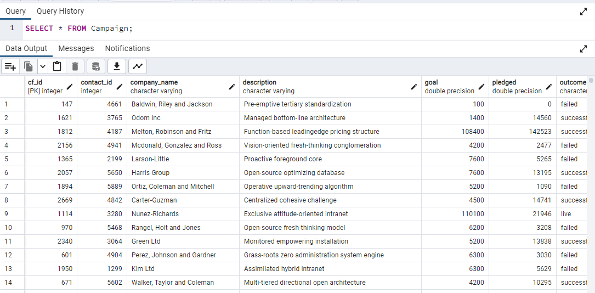

# Crowdfunding Campaigns ETL

## Overview
In this project:
* Extract data from two .xlsx files.
* Transform data and create four new .csv files..
* Load data into a database.

Technologies used: Python, Pandas, SQL, PostgreSQL

## Instructions
The instructions for this project are to create four DataFrames or tables based on the original two .xlsx files:
1. A category table with a newly created category_id column.
2. A subcategory table with a newly created subcategory_id column.
3. A campaign table with some columns renamed (blurb, launched_at, and deadline), some columns converted to the float (goal and pledged) or datetime (launch_date and end_date) format, some columns dropped, and the category_id and sub_category_id added.
4. A contacts table with the original string data broken up into four columns, contact_id, first_name, last_name, and email.

## The Project
The extract, transform, and load (ETL) python script can be found [here](crowdfunding_etl.py).

The SQL table schemata can be found [here](crowdfunding_db_schema.sql).

An [entity-relationship diagram (ERD)](crowdfunding_db_erd.png) of the database tables:

An image of the [contacts table](Screenshots/contacts_table.png) with data loaded properly:

An image of the [category table](Screenshots/category_table.png) with data loaded properly:

An image of the [subcategory table](Screenshots/subcategory_table.png) with data loaded properly:

An image of the [campaign table](Screenshots/campaign_table.png) with data loaded properly:

